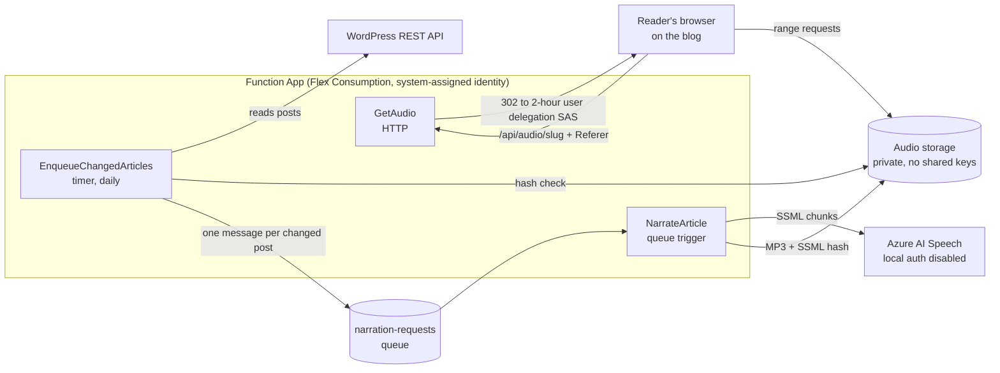

# CloudTales Narrator

Turns every post on a WordPress site into natural-sounding audio with Azure AI Speech, and plays it back only on that site. It runs in production on [cloudtales.gr](https://cloudtales.gr), where every article has a "Listen to this article" player.

It is also a reference for a **zero-key architecture** on Azure: no storage account keys, no Speech API keys, no Application Insights instrumentation secrets, no connection strings with credentials. Every call between components is authenticated with Microsoft Entra ID, and the keys that would otherwise exist are **disabled at the resource level**, not just unused.

## How it works



1. **Daily check (seconds).** `EnqueueChangedArticles` reads all published posts, builds the SSML for each, and compares its SHA-256 hash with the hash stored on the existing MP3. Only new or changed posts are queued, up to a daily cap.
2. **One post per execution.** `NarrateArticle` synthesizes a single post. Long posts are split into chunks under the real-time synthesis limit of 10 minutes of audio per request, synthesized in order and concatenated. Transient Speech errors are retried per chunk; anything else fails the message, which the platform retries and finally moves to the poison queue.
3. **Private playback.** The container is private. The WordPress player points at `GetAudio`, which checks that the request comes from the blog and redirects to a read-only, HTTPS-only SAS link valid for two hours, signed with a user delegation key (Entra ID, not an account key).

## The zero-key model

| Connection | Authentication | Key that would normally exist | Status |
|---|---|---|---|
| Function → Speech | Managed identity, *Cognitive Services Speech User* | Speech resource keys | `disableLocalAuth: true` |
| Function → audio storage | Managed identity, *Storage Blob Data Contributor* | Account keys | `allowSharedKeyAccess: false` |
| Function → host storage (runtime, queue, deployment package) | Managed identity, *Blob Data Owner* + *Queue Data Contributor* | `AzureWebJobsStorage` connection string | `allowSharedKeyAccess: false` |
| Function → Application Insights | Managed identity, *Monitoring Metrics Publisher* | Instrumentation key ingestion | `DisableLocalAuth: true` |
| Browser → audio | User delegation SAS, 2 h, read-only | Account-key SAS / public container | `allowBlobPublicAccess: false` |
| Developer CLI → Speech, storage | `az login` (Azure CLI credential) | Keys in `appsettings.json` | — |

`NarratorCredential` selects the credential explicitly: `ManagedIdentityCredential` when the host sets `NARRATOR_USE_MANAGED_IDENTITY=true`, `AzureCliCredential` everywhere else. `DefaultAzureCredential` is deliberately not used: probing the IMDS endpoint from a developer laptop behind a proxy times out instead of failing fast.

## Repository layout

```
infra/main.bicep                     every Azure resource and role assignment
src/CloudTales.Narrator.Core         WordPress client, HTML → SSML, Speech, Blob storage, pipeline
src/CloudTales.Narrator.Functions    timer, queue and HTTP functions
src/CloudTales.Narrator.Cli          narrate a single post locally (with --dryRun for zero cost)
wordpress/                           player snippet and CSS
deploy.ps1                           build and zip-deploy the Function App
```

## Deploy

Prerequisites: .NET 10 SDK, Azure CLI, a resource group, and *Owner* (or *User Access Administrator*) on it for the role assignments.

**1. Parameters.** Copy the working example and change every value:

```powershell
Copy-Item infra/examples/cloudtales.bicepparam infra/examples/mysite.bicepparam
```

| Parameter | Example | Notes |
|---|---|---|
| `namePrefix` | `mysite-narrator` | Resource names become `func-<prefix>-<suffix>`, `appi-<prefix>-<suffix>`, ... |
| `speechAccountName` | `mysite-speech` | Also the Speech custom subdomain, so it must be globally unique. Omit for a generated name. |
| `audioStorageAccountName` | `stmysiteaudio` | 3-24 lowercase letters and digits. Omit for a generated name. |
| `wordPressBaseUrl` | `https://example.com/` | With the trailing slash. |
| `allowedAudioHosts` | `example.com,www.example.com` | Only pages on these hosts can play the audio. |
| `siteName` | `Example` | Spoken in the intro of every narration. |
| `spokenAddress` | `example dot com` | Spoken in the outro of every narration. |

`siteName` and `spokenAddress` are part of the SSML, so they are part of its hash: changing them later re-synthesizes every post. Pick them once.

**2. Infrastructure.** `developerPrincipalId` is optional and grants your own user the data roles the CLI needs.

```powershell
az deployment group create -g <resource-group> -n main -p infra/examples/mysite.bicepparam `
  -p developerPrincipalId=$(az ad signed-in-user show --query id -o tsv)
```

**3. Code.**

```powershell
.\deploy.ps1 -ResourceGroup <resource-group>
```

**4. First run** without waiting for 04:00 UTC:

```powershell
$app = az deployment group show -g <resource-group> -n main --query properties.outputs.functionAppName.value -o tsv
$key = az functionapp keys list -g <resource-group> -n $app --query masterKey -o tsv
Invoke-WebRequest -Method Post -Uri "https://$app.azurewebsites.net/admin/functions/EnqueueChangedArticles" `
  -Headers @{ "x-functions-key" = $key } -ContentType "application/json" -Body "{}" -UseBasicParsing
```

**5. WordPress.** Add `wordpress/narrator-player.php` as a PHP snippet (for example with the Code Snippets plugin), set `CT_NARRATOR_AUDIO_BASE` to the `audioEndpoint` deployment output, and paste `wordpress/narrator-player.css` into Additional CSS.

### Run locally

The CLI reads the same settings from user secrets. Values come from the deployment outputs and your parameter file.

```powershell
cd src/CloudTales.Narrator.Cli
dotnet user-secrets set "WordPress:BaseUrl"       "https://example.com/"
dotnet user-secrets set "Narrator:SiteName"       "Example"
dotnet user-secrets set "Narrator:SpokenAddress"  "example dot com"
dotnet user-secrets set "Speech:ResourceId"       "<speechResourceId output>"
dotnet user-secrets set "Speech:Region"           "<region>"
dotnet user-secrets set "Storage:BlobEndpoint"    "<audioBlobEndpoint output>"

dotnet run -- --slug <post-slug> --dryRun true   # writes the SSML only, no Azure calls
dotnet run -- --slug <post-slug> --check true    # compares hashes with stored audio, no Speech cost
dotnet run -- --slug <post-slug>                 # synthesizes and uploads if the post changed
```

## Cost

Speech is billed per character synthesized; everything else is close to zero at blog scale.

- **Synthesis happens once per post version.** The SSML hash (which includes the voice name) decides whether a post needs audio; an unchanged post costs nothing on every later run.
- **Daily cap** (`maxSynthesesPerRun`, default 3) bounds the worst case per day, including the initial backfill of an existing blog.
- **Per-chunk retries** avoid re-billing chunks that already succeeded when the service has a transient failure.
- Rough guide: about 1 minute of audio per 1,000 characters. HD voices cost more per character than standard neural voices; check current [Speech pricing](https://azure.microsoft.com/pricing/details/cognitive-services/speech-services/).

## What the playback protection does and does not do

It blocks hotlinking from other sites, removes permanent public URLs, and makes any copied link expire within two hours. It is not DRM: anyone listening in a browser can save the audio, and a script can forge a `Referer` header. For a public blog that is the right trade-off; stronger edge enforcement (for example Front Door with WAF rules) costs more than the problem it solves.

## Lessons learned

- **One long execution is the wrong shape for serverless.** The first version narrated all posts in a single timer run. Flex Consumption drained the instance mid-run; the work finished, but the telemetry was lost. Queue fan-out gives one short, observable, retryable execution per post.
- **Real-time synthesis caps output at 10 minutes of audio per request,** on every pricing tier. Chunking at paragraph boundaries keeps each request well under it.
- **Windows PowerShell zips use `\`.** Linux hosts reject the package (`.azurefunctions` "missing"); `deploy.ps1` builds the zip with `/` separators.
- **Zip timestamps have no time zone.** Files extracted from an archive can look older than existing build output and silently skip compilation; `deploy.ps1` always does a full rebuild.

## License

[MIT](LICENSE)
